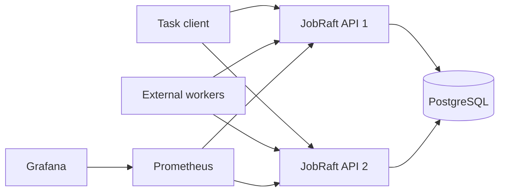
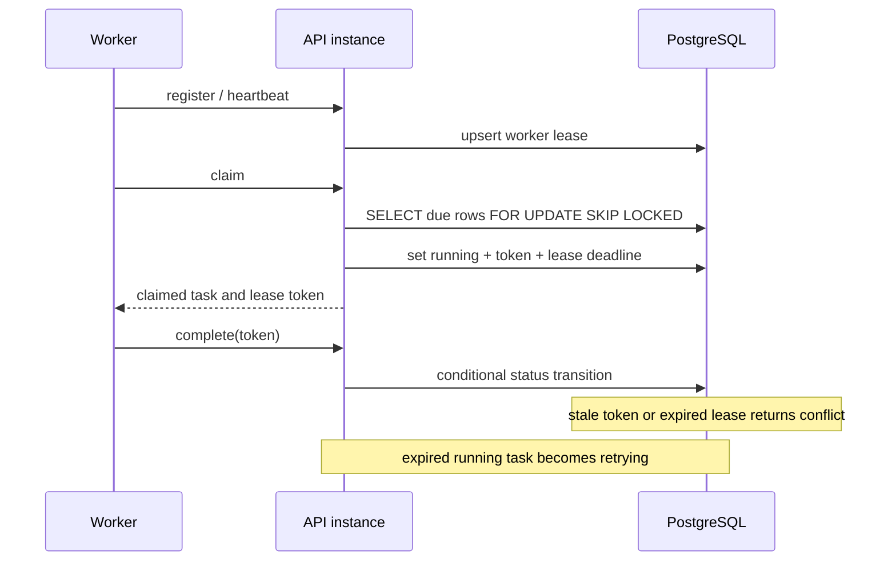

# Architecture and Interview Notes

## Runtime topology

Both API instances use PostgreSQL as the shared task and worker-lease store.
`ClaimDue` locks due rows with `FOR UPDATE SKIP LOCKED`, checks dependencies,
then assigns a random lease token and a deadline in the same transaction.

## Claim and recovery sequence

## Semantics

- Delivery is at-least-once. A lease expiry can cause a task to run again.
- Task handlers must be idempotent.
- A completion, cancellation, and lease recovery all use conditional state
  changes so a stale worker cannot overwrite a newer state.
- PostgreSQL is the shared consistency boundary. The in-process consensus model
  is retained only for deterministic tests; it is not described as network Raft.

## Resume-ready description

Built JobRaft, a Go task scheduler with delayed execution, dependencies,
retries, idempotent submission, Worker leases, PostgreSQL persistence, and
multi-instance task claiming. Used `FOR UPDATE SKIP LOCKED` plus lease-token
compare-and-set updates to provide at-least-once delivery and prevent stale
workers from overwriting task state. Added Docker Compose, Prometheus/Grafana,
database integration tests, race-test CI, and a repeatable benchmark tool.

In the local Docker Compose reference run documented in
`docs/benchmark-results.md`, 8 external Workers completed 1,000 tasks at
40.67 tasks/s with a Prometheus P95 queue latency of 14.70 seconds.
