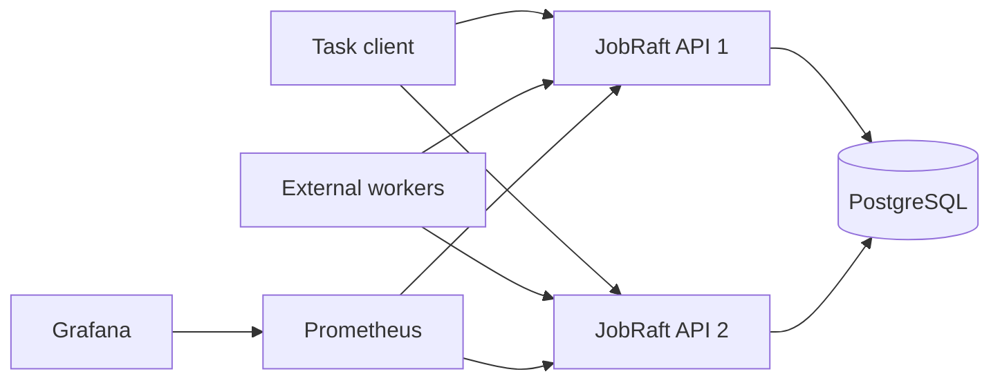
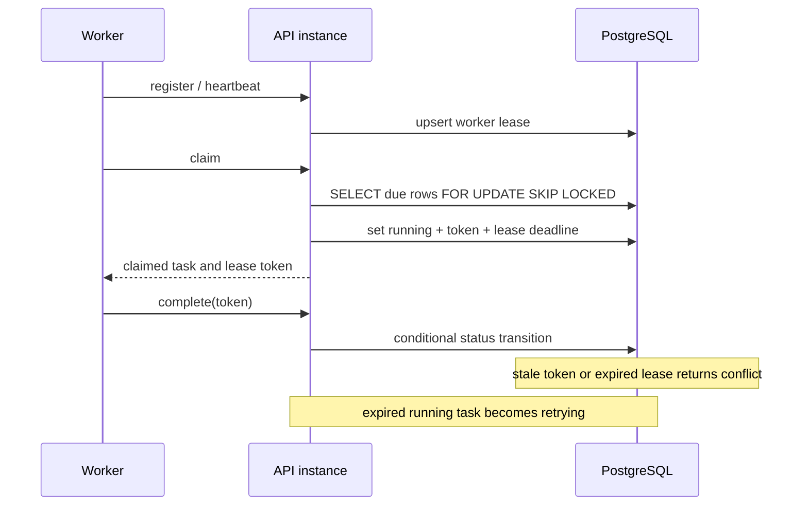

# Architecture and Interview Notes

## Runtime topology

Both API instances use PostgreSQL as the shared task and worker-lease store.
`ClaimDue` locks due rows with `FOR UPDATE SKIP LOCKED`, checks dependencies,
then assigns a random lease token and a deadline in the same transaction.

A scheduler tick asks the store two questions instead of reading the table:
which tasks are due now (`ListDue`) and which running tasks lost their lease
(`ListExpired`). Both are index lookups, so the cost of a tick follows the work
that is actually ready rather than the number of tasks the deployment has ever
run. Stores that implement only the base `Store` interface still work: the
scheduler then lists everything and filters in memory.

## Claim and recovery sequence

## Semantics

- Delivery is at-least-once. A lease expiry can cause a task to run again.
- Task handlers must be idempotent.
- A completion, cancellation, and lease recovery all use conditional state
  changes so a stale worker cannot overwrite a newer state.
- PostgreSQL is the shared consistency boundary. The in-process consensus model
  is retained only for deterministic tests; it is not described as network Raft.

## Resume-ready description

Built JobRaft, a Go task scheduler with delayed execution, dependencies,
retries, idempotent submission, Worker leases, PostgreSQL persistence, and
multi-instance task claiming. Used `FOR UPDATE SKIP LOCKED` plus lease-token
compare-and-set updates to provide at-least-once delivery and prevent stale
workers from overwriting task state. Added Docker Compose, Prometheus/Grafana,
database integration tests, race-test CI, and a repeatable benchmark tool. The
scheduler tick reads due work and lapsed leases through index-backed queries, and
a claim walks the backlog in priority order through a matching partial index, so
neither cost grows with the size of the task table.

In the local reference runs documented in `docs/benchmark-results.md`, 8 external
Workers completed 1,000 tasks against PostgreSQL at a median of about 130 tasks/s
across five runs, with a mean queue latency of about 3 seconds. Repeated batches
on the same host landed between 129 and 156 tasks/s (overall median 137 over
fifteen runs), so run-to-run variance is wider than the effect of the store-level
work; the cost of that work is reported separately, per store operation.
